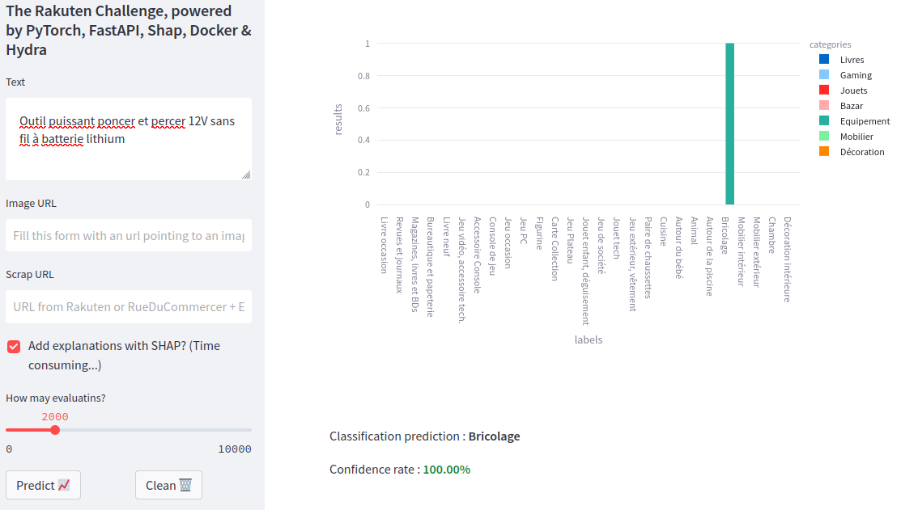
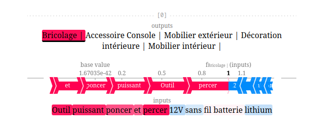
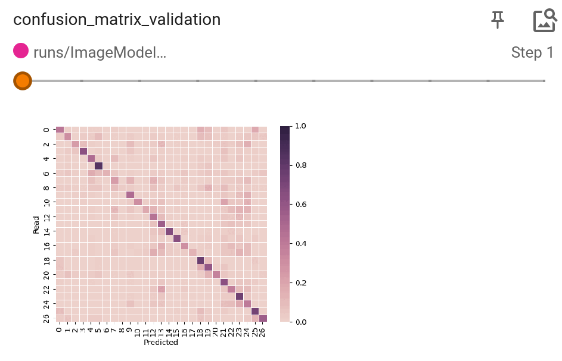
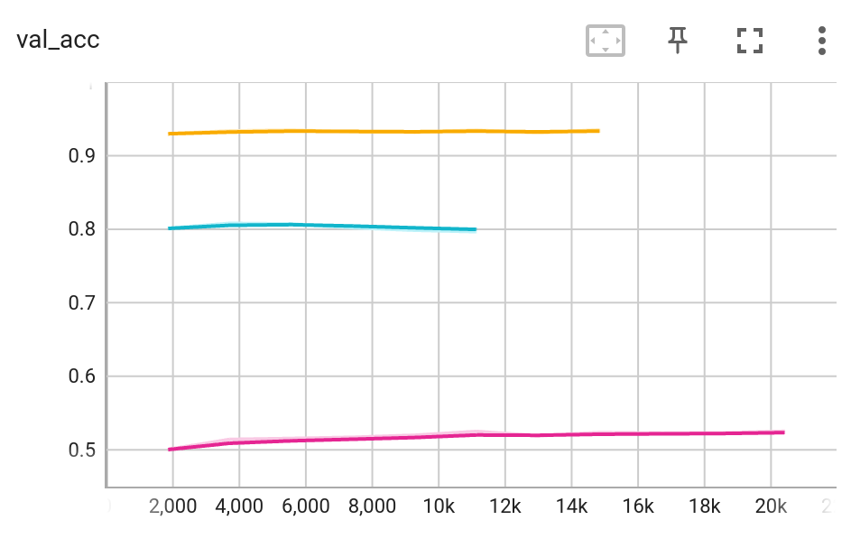
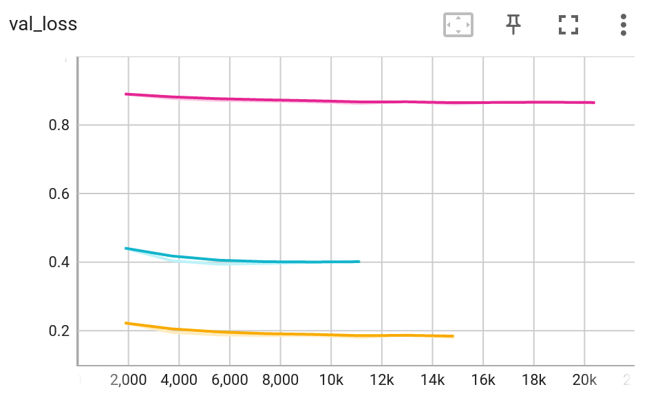

# Rakuten Challenge

## Presentation

This repository contains the code for project Rakuten based on data issued by Rakuten Challenge and developed during Data Scientist training at DataScientest.

The cataloging of product listings through title and image categorization is a fundamental problem for any e-commerce marketplace. The traditional way of categorizing is to do it manually. However, this takes up a lot of employees’ time and can be expensive.

The goal of this project is to predict a product’s type code through its description and image for the e-commerce platform Rakuten.


## Overview 

The frontend gives the user the possibility to make requests to the backend (where the models are running). It then shows the predicted category associtated with the probabilities.



A Shap explainer is also provided : the choice of the category will be explained in details ! 



Here are some of the librairies used to handle the project : 
- Backend callable with `fastAPI`
	- Datasets : `PyTorch`
	- Dataloaders and training :  `PyTorch Lightning`
	- Configuration : `Hydra`
	- Explainer : `Shap`
- Frontend : `Streamlit`
- Deploiement : `Docker`

### Dataset

The dataset contains `84916` observations. Each observation is a combination of texts (product's description and designation) and an `500x500` image.

### Models

Three different deep learning models are used to handle those features:
1. A text classifier
2. An image classifier
3. A fusion model which can handle both text and images

## Configure, run, train and test ! 

### Get the data

The data can be found here : https://challengedata.ens.fr/challenges/35.

### Create your model(s) (or use the provided ones)

Some models are provided in the `src/models` folder, but feel free to create your own models. 

Details of the provided `TextModelEmbeddingBag` model :
- An `nn.EmbeddingBag` layer gets the text features tokenized by a `CamemBERT` tokenizer and vectorize the text in 200 embedding dimensions
- A `nn.Flatten` layer
- A simple and final `nn.Linear` classifier

> **Info** : this model also saves the embedding layer in order to look at it directy in `tensorboard` (with the Projector and after a PCA reduction)


Details of the provided `ImageModelMobileNetV2` model :
- An `nn.EmbeddingBag` layer gets the text features tokenized by a `CamemBERT` tokenizer and vectorize the text in 200 embedding dimensions
- A `nn.Flatten` layer
- A simple and final `nn.Linear` classifier

> **Info** : at each epoch, a confusion matrix is build. The evolution of this confusion matrix during the training can also be seen in `tensorboard` 



### Configure with Hydra and .env files

Control everything with your hydra configuration file ! 
* The model you want to use
* The location of your data
* The dataset
* The compilation
* The training and the callbacks

Here is an example of `src/conf/conf.yaml`:

```yaml
defaults:
  - model: TextModelEmbeddingBag

paths:
  log: "./runs"
  data: "../data/raw"

files:
  features_data: X_train_update.csv
  labels_data: Y_train_CVw08PX.csv

dataset:
  splits: [.7, .15, .15]
  crop_shape: 400
  resize_shape: 224
  samples: 0 #0 for all dataset
  vocab_size: ${model.vocab_size}

compilation:
  batch_size: 32
  num_workers: 6

trainer:
  _target_: lightning.Trainer
  default_root_dir : "./runs"
  max_epochs: 25
  log_every_n_steps : 2
  logger:
    _target_: lightning.pytorch.loggers.TensorBoardLogger
    save_dir: ${trainer.default_root_dir}
    name: ${model.name}
    default_hp_metric : false
    log_graph: True
  callbacks:
    - _target_ : lightning.pytorch.callbacks.TQDMProgressBar
    - _target_ : lightning.pytorch.callbacks.ModelCheckpoint
      monitor: "val_loss"
      mode: "min"
      save_last: false
      save_top_k: 3
    - _target_ : lightning.pytorch.callbacks.EarlyStopping
      monitor: "val_loss"
      mode: "min"
      min_delta: 0.0
      patience: 3
  ```

### Run everything

First and last command line : 

```python
docker-compose up --build
```
...and that's it. This command runs in two docker containers:
- your frontend with Streamlit
- your backend with fastAPI

#### Train from docker

Everything is set up, but you don't have any models to use... (I couldn't upload them, they are much to heavy !). So let's train yours :)

Go to your fastAPI container :

http://<fast_api_container_IP>/docs#/default/train_model_api_v1_train_post

And edit the name of the model you want to train and execute the request. You can for example use the provided models such as :
- "name": "TextModelEmbeddingBag"
- "name": "ImageModelMobileNetV2"
- "name": "FusionModel"

> **Info** : this coulb be long... Don't forget to modify your `src/conf/conf.yaml` to modify the training.

Don't hesitate to follow the training of your models with `tensorboard`. Here are the validation accuracy and loss for the 
<span style="color:cyan">TextModelEmbeddingBag</span>, <span style="color:magenta">ImageModelMobileNetV2</span> and <span style="color:orange">FusionModel</span>.




### Make your prediction with the Streamlit frontend

Everything is running, your models are trained, so the next step is to have fun with your streamlit app ;)


## To do ...

- [X] Update the docker-compose file
- [ ] Add new tokens to the tokenizer and save it in order to enrich the vocabulary
- [ ] Load the tokenizer from Hydra
- [ ] Verify the behavior of the image explainer : there is probably a swap of dimensions somewhere
- [ ] Push prdcodetype2label and label2categorie in an object
- [ ] Push the URL_xxx in Hydra or .env
- [ ] Merge Hydra and .env ?
- [ ] Add other scrapers
- [ ] Enable the user to make a prediction on the test set
- [X] Allow the user to train a model from inside a container
- [ ] Select the best versions of your models in the Hydra configuration file and load those versions in the `fast.py` script.

## Contributions

The initial project was developed by the following team :
- Charly ([GitHub](https://github.com/karolus-git/))
- Olga ([GitHub](https://github.com/data-modelisation/) / [LinkedIn](https://www.linkedin.com/in/tolstolutska/))
- Mohamed ([GitHub](https://github.com/mbachkat/) / [LinkedIn](https://fr.linkedin.com/in/mo-bachkat-7389451a3/))
